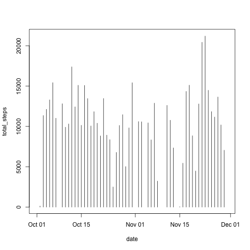
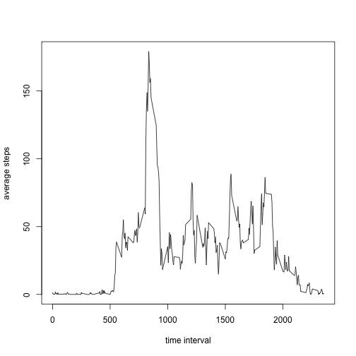
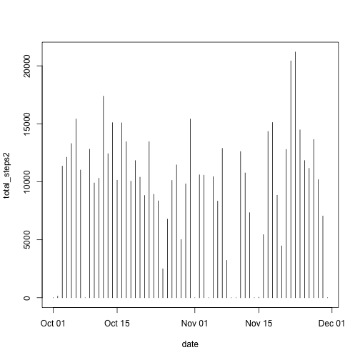
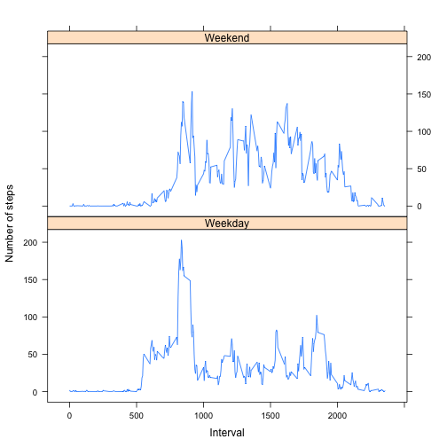

# Reproducible Research: Peer Assessment 1
**Yichao Hu**

## Loading and preprocessing the data

```r
# read the "activity.csv" from working dirctionary
activity <- read.csv("activity.csv")
```

```
## Warning in file(file, "rt"): cannot open file 'activity.csv': No such file
## or directory
```

```
## Error in file(file, "rt"): cannot open the connection
```


## Calculating and plotting the mean steps per day: 
1. Calculate total number of steps taken per day:(shown in the histogram)
2. Make a histogram of the total number of steps taken each day:

```r
activity_per_day <- split(activity, activity$date)  
# split the activity dataset into each day
total_steps <- sapply(activity_per_day, function(ele) sum(ele[1]))  
# total number of steps per day
steps_per_day <- as.data.frame(total_steps)
steps_per_day$date <- as.Date(names(activity_per_day))
# convert the column of data into Date format
with(steps_per_day, plot(date, total_steps, type = "h"))
```

 

3.The mean of total steps each day

```r
mean_steps <- mean(total_steps, na.rm = TRUE) 
```
The total mean step each day is 1.0766189 &times; 10<sup>4</sup>.

The median of total steps each day

```r
median_steps <- median(total_steps, na.rm = TRUE)
```
The median of total steps each day is 10765.
  
  
   
## The average daily activity pattern:
1. Make step-interval plot to show the average number of steps across all days:

```r
activity_per_interval <- split(activity, activity$interval)
average_interval_steps <- sapply(activity_per_interval, function(ele) sum(ele[1], na.rm = TRUE) / nrow(ele))
steps_per_interval <- as.data.frame(cbind(as.integer(names(average_interval_steps)), as.numeric(average_interval_steps)))
colnames(steps_per_interval) = c("time_interval", "average_interval_steps")
plot(steps_per_interval$time_interval, steps_per_interval$average_interval_steps, type = "l", xlab = "time interval", 
ylab = "average steps")
```

 

2. The maximum steps interval:

```r
max_interval <- subset(steps_per_interval, average_interval_steps == max(steps_per_interval$average_interval_steps))
max_period <- max_interval$time_interval
max_interval
```

```
##     time_interval average_interval_steps
## 104           835               179.1311
```
From the analysis above, the maximun-steps-interval is 835.


## Imputing missing values

```r
number_na = nrow(activity) - nrow(na.omit(activity))
```
1. The total number of mission values is 2304.

2. The strategy for filling all of the missing values is switching the NA in the dataset with numeric value 0.

3. Create a new dataset --- activity_fill:

```r
activity_fill <- activity
for (i in 1:nrow(activity_fill)){
if (is.na(activity_fill$steps[i])){
activity_fill$steps[i] <- 0
}}
```

4.Plot the histogram of the total number of steps taken each day. 

```r
activity_per_day2 <- split(activity_fill, activity_fill$date) 
total_steps2 <- sapply(activity_per_day2, function(ele) sum(ele[1], na.rm = TRUE)) 
steps_per_day2 <- as.data.frame(total_steps2)
steps_per_day2$date <- as.Date(names(activity_per_day2))
with(steps_per_day2, plot(date, total_steps2, type = "h"))
```

 

mean of total steps each day

```r
mean_steps2 <- mean(total_steps2) 
mean_steps2
```

```
## [1] 9354.23
```

median of total steps each day

```r
median_steps2 <- median(total_steps2)
median_steps2
```

```
## [1] 10395
```

Through the analysis above, we can see that the missing value in the database affect the computing of mean and median. With missing value int the dataset, the computing process will exclude the term with NA automatically, which will slightly reduce the number of denominator.

## Analyze the differences in activity patterns between weekdays and weekends.

```r
# add a column "weekday", convert the date into weekday with the function weekdays()
activity$weekday <- weekdays(as.Date(as.character(activity$date)), abbr = TRUE)
# Matching the column into "Weekend" and "Weekday"
activity$weekday[grepl("Sat|Sun", activity$weekday)] <- "Weekend"
activity$weekday[grepl("Mon|Tue|Thu|Wed|Fri", activity$weekday)] <- "Weekday"
# subsetting two dataset to further analysis
activity_weekday <- subset(activity, weekday == "Weekday")
activity_weekend <- subset(activity, weekday == "Weekend")
# Calucate the activity pattern in weekdays.
activity_weekday_interval <- split(activity_weekday, activity_weekday$interval)
average_steps_weekday <- sapply(activity_weekday_interval, function(ele) sum(ele[1], na.rm = TRUE) / nrow(ele))
steps_weekday <- as.data.frame(cbind("time_interval" = as.integer(names(average_steps_weekday)), 
                                     "average_steps" = as.numeric(average_steps_weekday)))
steps_weekday$weekday <- "Weekday"
# Calucate the activity pattern in weekends.
activity_weekend_interval <- split(activity_weekend, activity_weekend$interval)
average_steps_weekend <- sapply(activity_weekend_interval, function(ele) sum(ele[1], na.rm = TRUE) / nrow(ele))
steps_weekend <- as.data.frame(cbind("time_interval" = as.integer(names(average_steps_weekend)), 
                                     "average_steps" = as.numeric(average_steps_weekend)))
steps_weekend$weekday <- "Weekend"
# combine two sub-datasets
steps_week <- rbind(steps_weekday, steps_weekend)
# factor the weekday column to plot
steps_week$weekday <- factor(steps_week$weekday)
# plot the activity pattern between weekdays and weekends.
library(lattice)
xyplot(average_steps ~ time_interval | weekday, data = steps_week, type = "l", layout = c(1, 2), ylab = "Number of steps", xlab = "Interval")
```

 
